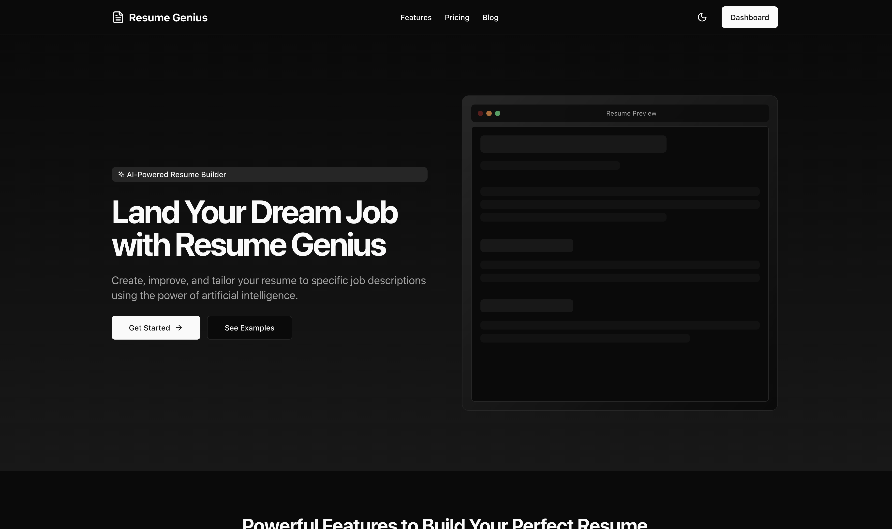

# Resume Genius

A modern, AI-powered resume builder built with Next.js, TypeScript, and Tailwind CSS. Create professional resumes with ease, get AI-powered suggestions, and match your resume with job descriptions.



## Features

- 🎨 **Modern UI/UX**: Clean and intuitive interface built with Tailwind CSS and shadcn/ui
- 🤖 **AI-Powered Features**:
  - Smart resume suggestions
  - Job description matching
  - Content optimization
- 📝 **Resume Management**:
  - Create and edit multiple resumes
  - Track completion progress
  - Preview before export
- 💼 **Job Description Integration**:
  - Save and manage job descriptions
  - Match resume against job requirements
  - Create tailored resumes for specific jobs
- 🎯 **Smart Features**:
  - Progress tracking
  - Completion rate monitoring
  - Last updated tracking
- 🌓 **Theme Support**:
  - Light and dark mode
  - System theme detection
- 📱 **Responsive Design**:
  - Works on all devices
  - Optimized layouts for mobile and desktop

## Tech Stack

- **Framework**: Next.js 14 with App Router
- **Language**: TypeScript
- **Styling**: Tailwind CSS
- **UI Components**: shadcn/ui
- **Animations**: Framer Motion
- **State Management**: React Hooks
- **Authentication**: Custom Auth Context
- **Icons**: Lucide Icons
- **Notifications**: Sonner Toast

## Getting Started

### Prerequisites

- Node.js 18+ 
- npm or yarn
- Git

### Installation

1. Clone the repository:
   ```bash
   git clone https://github.com/DAMunene/Resume-Genius.git
   cd Resume-Genius
   ```

2. Install dependencies:
   ```bash
   npm install
   # or
   yarn install
   ```

3. Create a `.env.local` file in the root directory:
   ```env
   NEXT_PUBLIC_API_URL=your_api_url
   ```

4. Start the development server:
   ```bash
   npm run dev
   # or
   yarn dev
   ```

5. Open [http://localhost:3000](http://localhost:3000) in your browser.

## Project Structure

```
├── app/
│   ├── dashboard/
│   │   ├── jobs/
│   │   ├── resume/
│   │   └── settings/
│   ├── auth/
│   └── layout.tsx
├── components/
│   ├── ui/
│   ├── resume/
│   └── dashboard-layout.tsx
├── context/
│   └── auth-context.tsx
├── lib/
│   └── utils.ts
├── public/
└── styles/
```

## Key Features Implementation

### Resume Creation
- Create new resumes with custom names
- Track completion progress
- Preview before export
- Multiple template support

### Job Description Management
- Save and organize job descriptions
- Search functionality
- Create tailored resumes for specific jobs
- Match resume against job requirements

### AI Integration
- Smart content suggestions
- Job description analysis
- Resume optimization
- Skills matching

### User Settings
- Account management
- Notification preferences
- Theme customization
- Subscription management

## Contributing

1. Fork the repository
2. Create your feature branch (`git checkout -b feature/AmazingFeature`)
3. Commit your changes (`git commit -m 'Add some AmazingFeature'`)
4. Push to the branch (`git push origin feature/AmazingFeature`)
5. Open a Pull Request

## License

This project is licensed under the MIT License - see the [LICENSE](LICENSE) file for details.

## Acknowledgments

- [Next.js](https://nextjs.org/)
- [Tailwind CSS](https://tailwindcss.com/)
- [shadcn/ui](https://ui.shadcn.com/)
- [Framer Motion](https://www.framer.com/motion/)
- [Lucide Icons](https://lucide.dev/)

## Support

For support, email damunene@gmail.com or create an issue in the repository.

---

Made with ❤️ by [David Munene] 